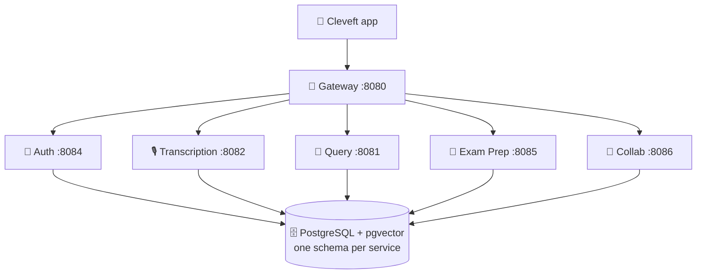

<div align="center">

# 🏗️ Cleveft Infra

**Database schema, Docker orchestration and shared configuration.**

The one repository that knows how all six services fit together — and the only
place the schema is defined.

<br/>


</div>

---

## 🧭 The system



---

## 📁 What lives here

| File | Purpose |
| :--- | :--- |
| `init.sql` | **Canonical** schema. Single source of truth for all services. |
| `migrations/` | Numbered schema changes, applied in order to an existing database. |
| `migrate.sh` | The runner. Executed by the `migrator` service, not by hand. |
| `docker-compose.yml` | PostgreSQL + pgvector, plus an optional profile for every service. |
| `docker-compose.prod.yml` | Single-server deployment. Every service, one published port. |
| `.env.example` | Template for local secrets. Copy to `.env`. |
| `.env.prod.example` | Template for server secrets. Copy to `.env.prod`. |

---

## 🚀 Quick start

```bash
cp .env.example .env          # then fill in GOOGLE_API_KEY and JWT_SECRET
docker compose up -d          # postgres only, on localhost:5433
```

Bring up the whole backend in containers:

```bash
docker compose --profile services up -d --build
```

The gateway is then the only port you need: **<http://localhost:8080>**

---

## ☁️ Deploying to one server

`docker-compose.prod.yml` runs the whole backend on a single machine — six
services and a database on about 4 GB of RAM.

```bash
cp .env.prod.example .env.prod        # fill in, then keep it off git
docker compose -f docker-compose.prod.yml --env-file .env.prod up -d --build
```

Three things differ from the local file, all of them deliberate:

**Only the gateway publishes a port.** Postgres and the five services are
reachable from inside the compose network and from nowhere else. A database on a
public IP with a password the whole team knows is found by scanners within
hours.

**Every JVM is capped.** `-XX:MaxRAMPercentage=60 -XX:+UseSerialGC` — six Spring
Boot services will each happily assume the machine is theirs alone, and the
default collector costs memory this box does not have.

**Migrations gate startup.** The `migrator` service runs first and the others
wait on `service_completed_successfully`, so no service can come up against a
schema older than the code inside it.

> [!WARNING]
> The gateway serves plain HTTP. That is survivable for a demo behind a firewall
> rule, but Android needs an explicit cleartext exemption to talk to it and iOS
> refuses outright. Anything longer-lived wants TLS in front.

---

## 🗄️ Schema ownership

One schema per microservice. **No service reads another service's schema** —
cross-service data is fetched over HTTP.

| Schema | Owner | Port |
| :--- | :--- | :--- |
| `auth` | [`Cleveft-auth-service`](https://github.com/Cleveft-Project/Cleveft-auth-service) | 8084 |
| `transcription` | [`cleveft-transcription-service`](https://github.com/Cleveft-Project/cleveft-transcription-service) | 8082 |
| `query` | [`cleveft-query-service`](https://github.com/Cleveft-Project/cleveft-query-service) | 8081 |
| `exam_prep` | [`cleveft-examprep-service`](https://github.com/Cleveft-Project/cleveft-examprep-service) | 8085 |
| `collab` | [`cleveft-collab-service`](https://github.com/Cleveft-Project/cleveft-collab-service) | 8086 |

> [!IMPORTANT]
> `transcription.chunks` is the only vector table in the system. The query and
> exam-prep services retrieve lecture context by calling the transcription
> service's `/api/v1/transcriptions/search` endpoint, never by querying pgvector
> directly.

---

## 🔄 Changing the schema

`init.sql` runs **only when the postgres volume is first created**, and this
volume is external and long-lived — so editing that file alone does nothing to a
database that already exists.

Schema changes therefore go in `migrations/` as a new numbered file:

```
migrations/
  001_align_to_canonical_schema.sql
  002_add_subscription_plan.sql
  003_topic_analytics_per_lecture.sql
  004_course_wide_quizzes.sql
  005_lecture_source.sql
```

The `migrator` service applies them in filename order on the next
`docker compose up`, **before** any service that reads the tables is allowed to
start — so the schema can never be older than the code reading it. Applied
filenames are recorded in `public.schema_migrations`.

Also update `init.sql`, which remains the readable description of the current
model and is what a brand-new volume is built from.

<details>
<summary><b>Two rules for a migration file</b></summary>

<br/>

**No `BEGIN`/`COMMIT`.** Each file already runs inside one transaction via
`--single-transaction`; a stray `COMMIT` closes the runner's transaction early
and leaves everything after it unprotected. Files 001–004 predate this rule and
still carry theirs.

**Make it idempotent.** The ledger prevents re-runs, but idempotence is what
makes a partially-migrated database recoverable.

</details>

> [!CAUTION]
> **Do not run `docker compose down -v`.** The postgres volume holds every
> lecture, transcript and quiz on this machine, and `-v` destroys it. No schema
> change requires it — that advice belongs to the era before this migration
> runner existed.

Every service runs with `ddl-auto=none`, so Hibernate will never silently create
or alter a table behind your back. If an entity and the schema disagree, the
service fails loudly at first query — that is intentional.

---

## 🔑 Secrets

`JWT_SECRET` must be **identical** across the gateway and the auth service; the
gateway validates the tokens the auth service signs. Anything shorter than 32
bytes is rejected by the HS256 signer at startup.

```bash
openssl rand -base64 48
```

> [!WARNING]
> `.env` holds a live API key and the signing secret. It is gitignored — keep it
> that way, and never commit a real value.

---

<div align="center">
<sub>Part of the <a href="https://github.com/Cleveft-Project">Cleveft</a> platform</sub>
</div>
